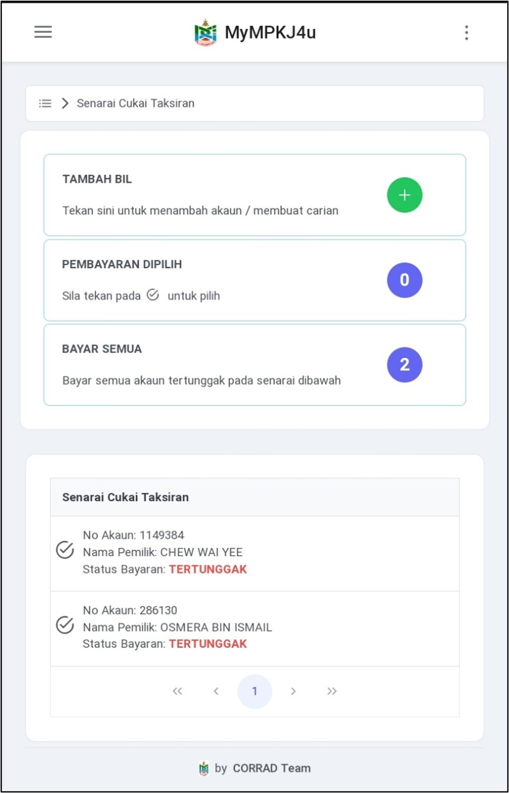

# Panduan Penggunaan Menu Cukai Taksiran

::: info Tujuan
Membantu pengguna untuk membuat carian, menambah bil cukai taksiran, dan melihat maklumat bil dalam sistem MyMPKj4u.
:::

## Langkah-langkah Navigasi dan Menambah Bil Cukai Taksiran

### 1. Navigasi ke Menu Cukai Taksiran

::: tip Langkah 1
1. Buka pelayar web anda (contohnya Google Chrome)
2. Log masuk ke akaun MyMPKj4u
3. Pada halaman utama, klik menu **Cukai Transaksi**
:::

### 2. Tambah Bil Baharu

::: tip Langkah 2
1. Dalam halaman **Senarai Cukai Taksiran**, klik pada butang **Tambah Bil**
2. Paparan seperti gambar di bawah akan muncul
:::

### 3. Pilih Kaedah Carian

::: tip Langkah 3
1. Dalam bahagian **Carian Cukai Taksiran**, pilih kaedah carian sebagai **Nombor Akaun**
2. Masukkan **Nombor Akaun** yang anda ingin cari
:::

### 4. Cari Bil Cukai Taksiran

::: tip Langkah 4
1. Masukkan **Nombor Akaun** yang berkaitan
2. Klik butang **Search** untuk mencari bil cukai taksiran
3. Senarai bil akan dipaparkan di bawah
:::

### 5. Simpan Bil Cukai Taksiran

::: tip Langkah 5
1. Klik pada bil yang dipaparkan untuk menyimpan bil tersebut ke dalam akaun anda
2. Paparan mesej **"Maklumat telah berjaya disimpan"** akan muncul
:::

### 6. Lihat Maklumat Bil

::: tip Langkah 6
1. Bil yang telah disimpan akan dipaparkan dalam **Senarai Cukai Taksiran**
2. Klik pada bil tersebut untuk melihat maklumat lanjut
:::

::: warning Peringatan Penting
- Pastikan nombor akaun yang dimasukkan adalah tepat
- Simpan maklumat bil untuk rujukan masa hadapan
- Semak status bil secara berkala
:::