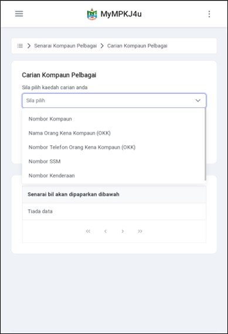

# Panduan Kompaun Pelbagai

- **Tujuan**: Membantu pengguna mencari dan menambah kompaun pelbagai ke dalam sistem MyMPKj4u untuk tujuan pembayaran.

## Langkah-langkah Menambah Kompaun Pelbagai

---

### 1. **Navigasi ke Menu Kompaun Pelbagai**
   - Buka pelayar web anda (contohnya Google Chrome).
   - Log masuk ke akaun MyMPKj4u.
   - Pada halaman utama, klik menu **Kompaun Pelbagai** seperti dalam gambar di bawah.

   

---

### 2. **Tambah Bil Kompaun**
   - Dalam halaman senarai kompaun, klik butang **TAMBAH BIL**.
   - Sistem akan memaparkan halaman carian kompaun.

   

---

### 3. **Pilih Kaedah Carian**
   - Pilih kaedah carian yang sesuai untuk mencari kompaun pelbagai.

   

---

### 4. **Carian Kompaun**
   Pengguna boleh membuat carian menggunakan beberapa kaedah:

   #### a) **Carian Menggunakan No Kompaun**
   - Masukkan nombor kompaun pada kotak carian.
   - Klik butang **Search**.
   - Senarai bil akan dipaparkan.
   - Klik pada bil untuk menyimpan.

   

   #### b) **Carian Menggunakan Nama Orang Kena Kompaun**
   - Masukkan nama orang kena kompaun.
   - Klik butang **Search**.
   - Senarai bil akan dipaparkan.
   - Klik pada bil untuk menyimpan.

   

   #### c) **Carian Menggunakan No SSM**
   - Masukkan nombor SSM.
   - Klik butang **Search**.
   - Senarai bil akan dipaparkan.
   - Klik pada bil untuk menyimpan.

   

   #### d) **Carian Menggunakan No Kenderaan**
   - Masukkan nombor kenderaan.
   - Klik butang **Search**.
   - Senarai bil akan dipaparkan.
   - Klik pada bil untuk menyimpan.

   

---

### 5. **Lihat Maklumat Bil**
   - Bil yang telah disimpan akan dipaparkan dalam senarai.
   - Klik pada bil untuk melihat maklumat terperinci.

   

---

::: warning Nota Penting
- Pastikan maklumat yang dimasukkan adalah tepat untuk mendapatkan hasil carian yang betul
- Kompaun yang telah disimpan akan kekal dalam senarai sehingga dibayar atau dipadam
- Untuk membuat pembayaran, sila rujuk panduan **Pembayaran Kompaun Pelbagai**
::: 