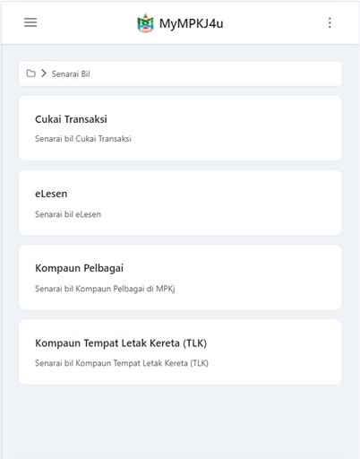
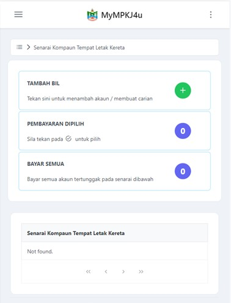
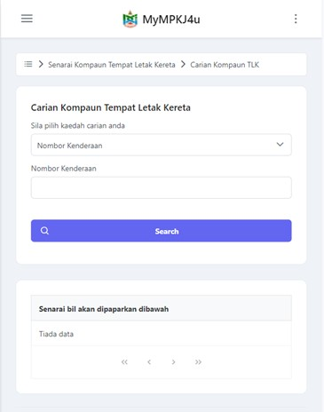
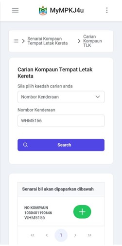
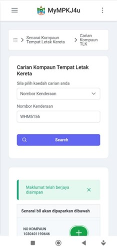

# Panduan Kompaun Tempat Letak Kereta (TLK)

::: info Tujuan
Membantu pengguna mencari dan menambah kompaun tempat letak kereta ke dalam sistem MyMPKj4u untuk tujuan pembayaran.
:::

## Langkah-langkah Menambah Kompaun TLK

### 1. Navigasi ke Menu Kompaun TLK

::: tip Langkah 1
1. Buka pelayar web anda (contohnya Google Chrome)
2. Log masuk ke akaun MyMPKj4u
3. Pada halaman utama, klik menu **Kompaun Tempat Letak Kereta (TLK)** seperti dalam gambar di bawah
:::

### 2. Tambah Bil Kompaun

::: tip Langkah 2
Dalam halaman senarai kompaun, klik butang **TAMBAH BIL**. Sistem akan memaparkan halaman carian kompaun.
:::

### 3. Carian Kompaun

::: tip Langkah 3
1. Pilih kaedah carian dari pilihan berikut:
   - **Nombor Kompaun**
   - **Nombor Telefon Orang Kena Kompaun (OKK)**
   - **Nombor Kenderaan**
2. Masukkan maklumat carian yang berkaitan
3. Klik butang **Search**
:::

### 4. Simpan Bil Kompaun

::: tip Langkah 4
1. Setelah hasil carian dipaparkan, senarai bil yang berkaitan akan ditunjukkan
2. Klik pada bil yang ingin disimpan
3. Sistem akan menambah bil tersebut ke dalam senarai kompaun anda
:::

### 5. Lihat Maklumat Kompaun

::: tip Langkah 5
1. Kembali ke halaman senarai kompaun
2. Klik pada kompaun yang telah disimpan untuk melihat maklumat terperinci
3. Sistem akan memaparkan butiran lengkap kompaun tersebut
:::

## Status Kompaun

::: details Status Kompaun yang Dipaparkan
- **SUDAH DIBAYAR**: Kompaun yang telah dijelaskan
- **TERTUNGGAK**: Kompaun yang masih belum dibayar
:::

## Fungsi Tambahan

### Pembayaran Dipilih
::: tip Pembayaran Dipilih
1. Pilih kompaun yang ingin dibayar dengan menanda pada kotak pilihan
2. Klik pada butang **PEMBAYARAN DIPILIH** untuk membayar kompaun yang telah dipilih
:::

### Bayar Semua
::: tip Bayar Semua
Klik pada butang **BAYAR SEMUA** untuk membayar semua kompaun tertunggak dalam senarai
:::

::: warning Nota Penting
- Pastikan maklumat yang dimasukkan adalah tepat untuk mendapatkan hasil carian yang betul
- Kompaun yang telah disimpan akan kekal dalam senarai sehingga dibayar atau dipadam
- Untuk membuat pembayaran, sila rujuk panduan **Pembayaran Kompaun Tempat Letak Kereta (TLK)**
::: 