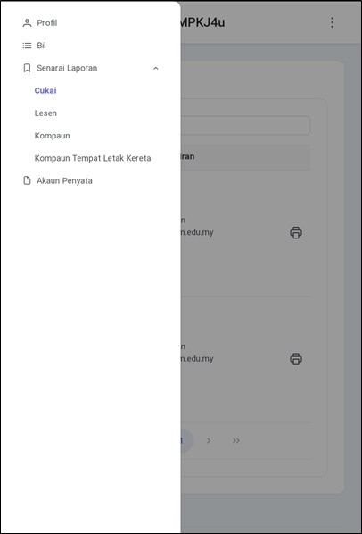
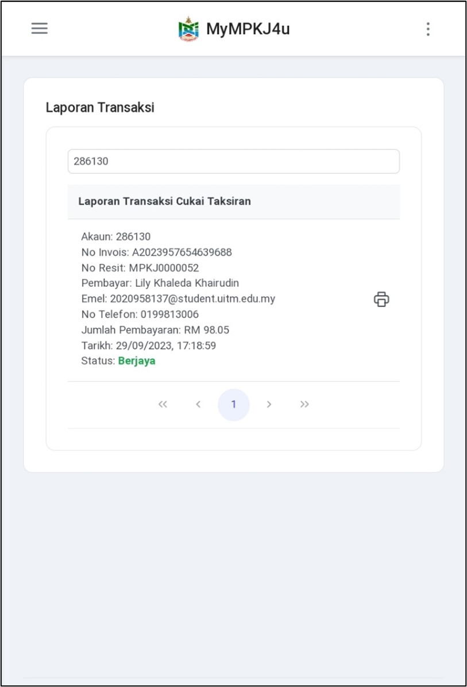
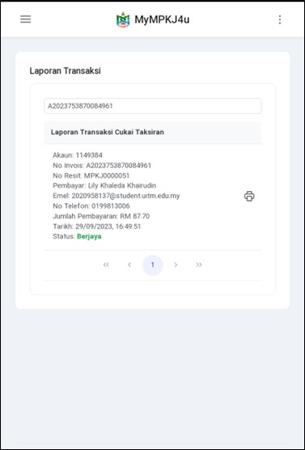
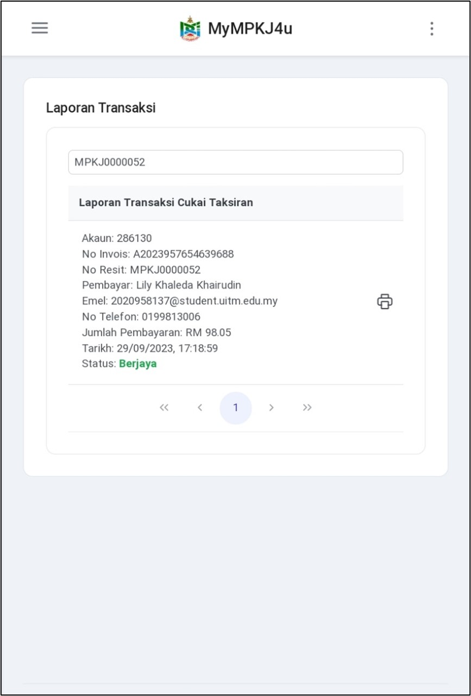
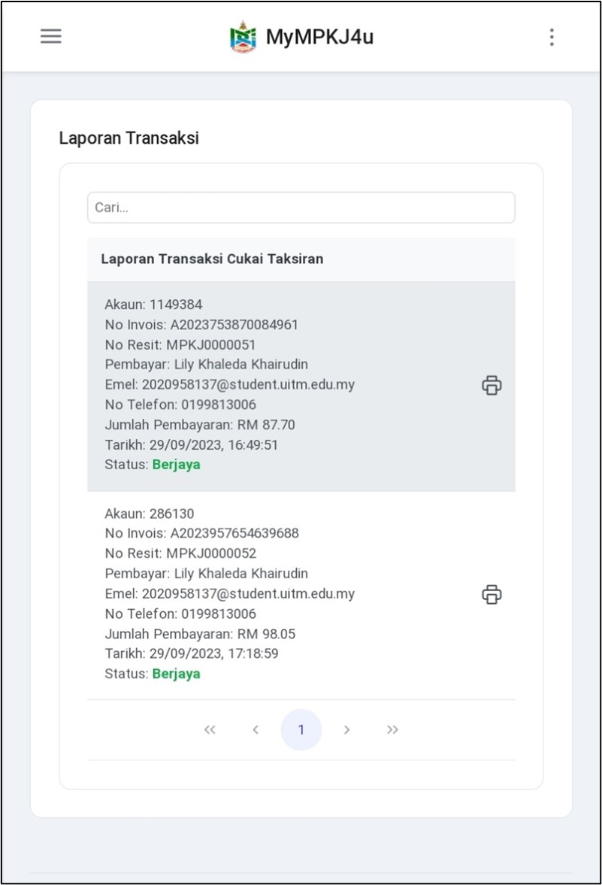
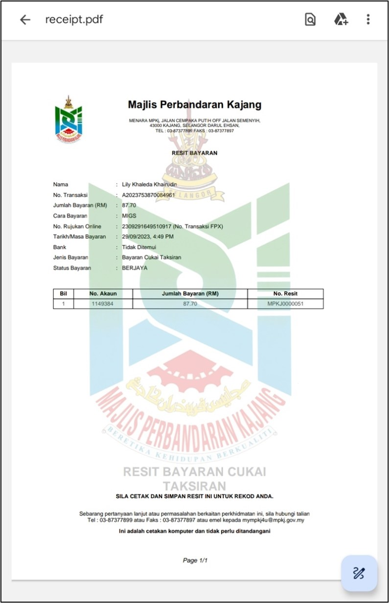

# Panduan Penggunaan Laporan Cukai Taksiran

::: info Tujuan
Membantu pengguna memahami cara mengakses dan memuat turun laporan cukai taksiran melalui sistem MyMPKj4u.
:::

## Langkah-langkah Penggunaan Laporan Cukai Taksiran

### 1. Navigasi ke Menu Senarai Laporan

::: tip Langkah 1
1. Buka pelayar web anda (contohnya Google Chrome)
2. Log masuk ke akaun MyMPKj4u
3. Pada menu utama, klik **Senarai Laporan**
4. Pilih submenu **Cukai**
:::

::: info Nota
Senarai laporan cukai taksiran akan dipaparkan sekiranya pengguna telah membuat pembayaran.
:::

### 2. Cari Laporan Cukai Taksiran

::: tip Kaedah Carian
Anda boleh mencari laporan menggunakan salah satu kaedah berikut:
:::

#### A. Carian Menggunakan No Akaun
::: tip
Masukkan **No Akaun** untuk melihat semua laporan transaksi berkaitan akaun tersebut.
:::

#### B. Carian Menggunakan No Invois
::: tip
Masukkan **No Invois** untuk mencari laporan transaksi tertentu.
:::

#### C. Carian Menggunakan No Resit
::: tip
Masukkan **No Resit** untuk mendapatkan laporan transaksi spesifik.
:::

### 3. Pilih Laporan Transaksi

::: tip Langkah 3
1. Lihat senarai laporan yang dipaparkan
2. Klik pada laporan yang ingin dilihat
3. Pilih laporan yang sesuai dengan maklumat carian anda
:::

### 4. Lihat Maklumat Terperinci

::: tip Langkah 4
Setelah memilih laporan, anda dapat melihat maklumat terperinci berikut:
- No Akaun
- No Invois
- No Resit
- Nama Pembayar
- Emel Pembayar
- Jumlah Pembayaran
- Tarikh Pembayaran
- Status Pembayaran
:::

::: warning Peringatan Penting
- Pastikan maklumat carian yang dimasukkan adalah tepat
- Simpan salinan laporan untuk rujukan
- Semak status pembayaran dengan teliti
:::

::: tip Petua
Untuk pencarian yang lebih tepat:
- Gunakan No Resit untuk mencari transaksi spesifik
- Gunakan No Akaun untuk melihat semua transaksi berkaitan
- Semak tarikh pembayaran untuk mengesan transaksi tertentu
:::