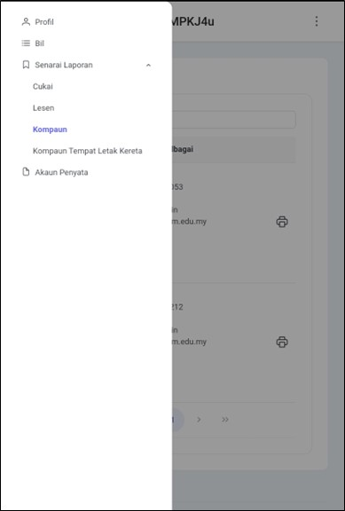
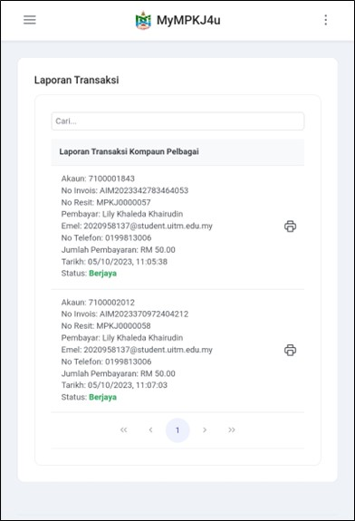
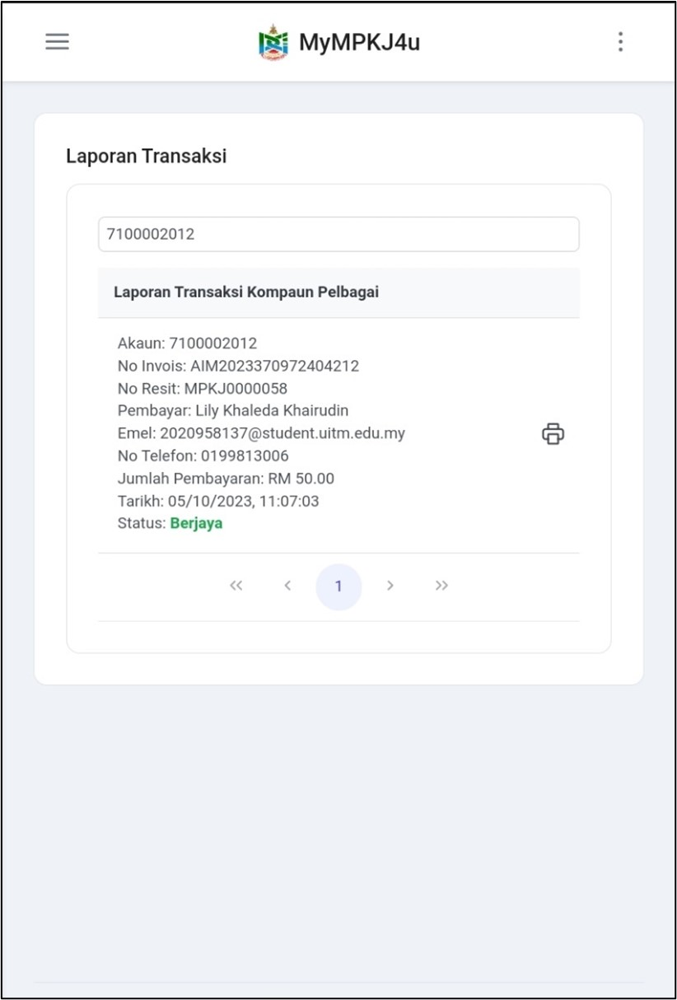
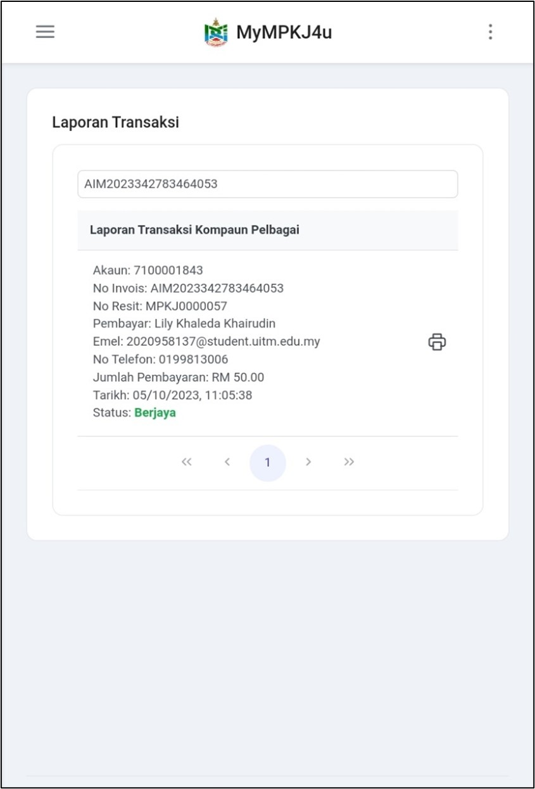
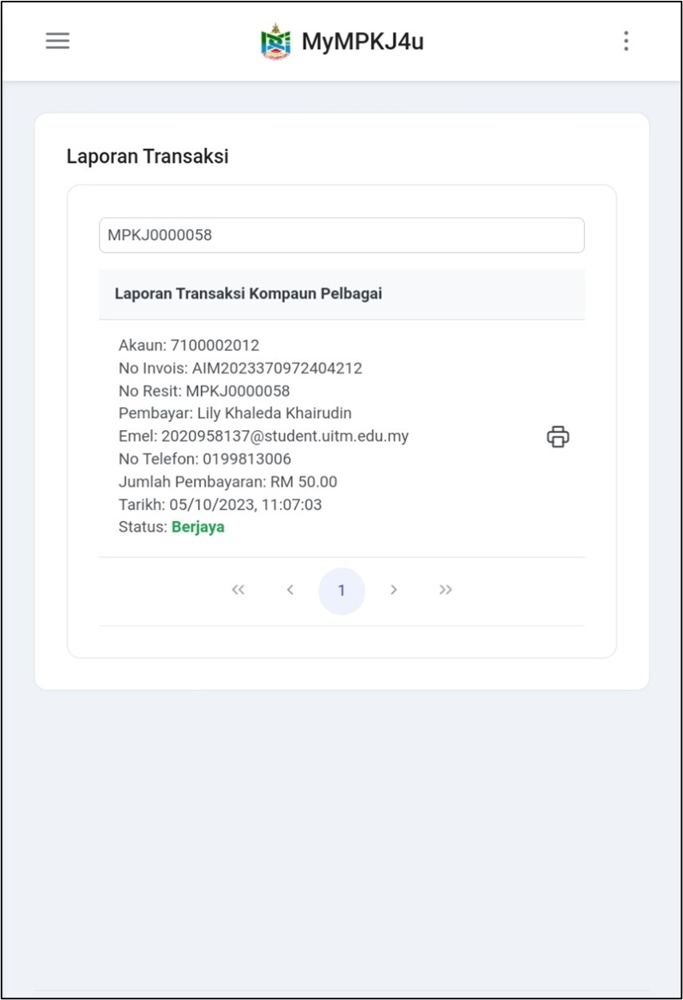
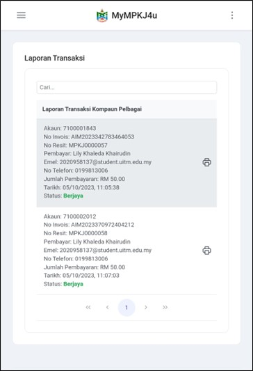

# Panduan Laporan Kompaun Pelbagai

- **Tujuan**: Membantu pengguna untuk melihat dan memuat turun laporan pembayaran kompaun pelbagai melalui sistem MyMPKj4u.

## Langkah-langkah Mengakses Laporan Kompaun Pelbagai

---

### 1. **Navigasi ke Menu Senarai Laporan**
   - Buka pelayar web anda (contohnya Google Chrome).
   - Log masuk ke akaun MyMPKj4u.
   - Pada halaman utama, klik menu **Senarai Laporan**.
   - Pilih menu **Kompaun**.
   - Senarai laporan kompaun akan dipaparkan sekiranya pengguna telah membuat pembayaran.

   
   

---

### 2. **Carian Laporan**
   Pengguna boleh membuat carian laporan menggunakan tiga kaedah:

   #### a) **Carian Menggunakan No Akaun**
   - Masukkan nombor akaun pada kotak carian.
   - Klik butang **Search** untuk mencari.

   

   #### b) **Carian Menggunakan No Invois**
   - Masukkan nombor invois pada kotak carian.
   - Klik butang **Search** untuk mencari.

   

   #### c) **Carian Menggunakan No Resit**
   - Masukkan nombor resit pada kotak carian.
   - Klik butang **Search** untuk mencari.

   

---

### 3. **Muat Turun Laporan**
   - Klik pada mana-mana laporan transaksi yang ingin dimuat turun.
   - Sistem akan memaparkan maklumat terperinci bayaran kompaun.
   - Laporan boleh dimuat turun dalam format PDF.

   
   

---

## **Maklumat Dalam Laporan**

Laporan transaksi mengandungi maklumat berikut:
- Nombor Kompaun
- Maklumat Pembayar
- Tarikh dan Masa Pembayaran
- Jumlah Bayaran
- Status Pembayaran
- Maklumat Resit

---

::: warning Nota Penting
- Laporan hanya boleh diakses untuk kompaun yang telah dibayar
- Pastikan anda menyimpan salinan laporan untuk rujukan
- Laporan boleh dimuat turun berulang kali mengikut keperluan
::: 