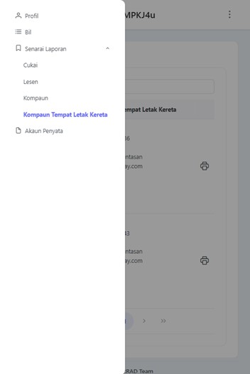
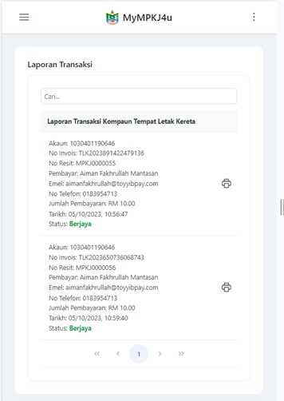
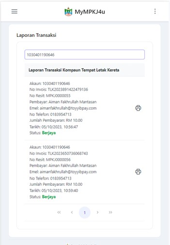
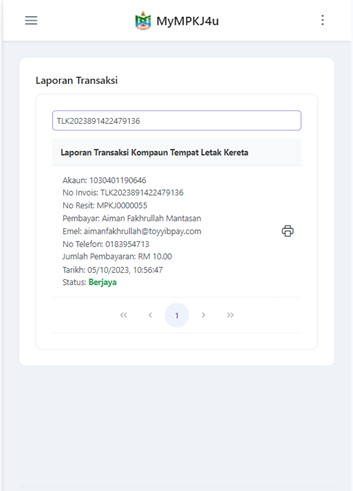
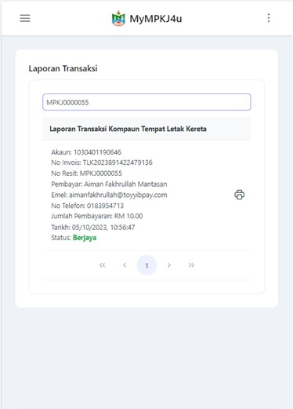
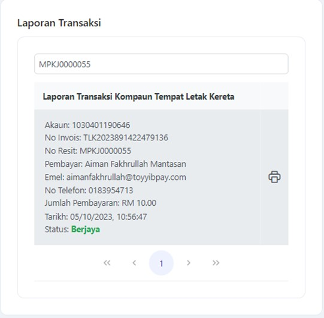
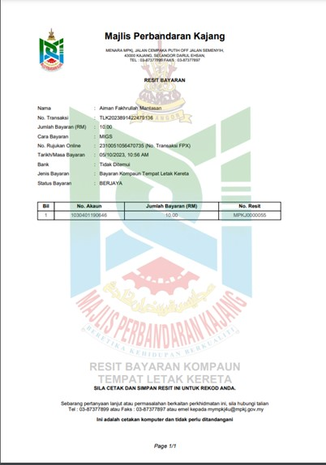

# Panduan Laporan Kompaun Tempat Letak Kereta (TLK)

::: info Tujuan
Membantu pengguna untuk melihat dan memuat turun laporan pembayaran kompaun tempat letak kereta melalui sistem MyMPKj4u.
:::

## Langkah-langkah Mengakses Laporan Kompaun TLK

### 1. Navigasi ke Menu Senarai Laporan

::: tip Langkah 1
1. Buka pelayar web anda (contohnya Google Chrome)
2. Log masuk ke akaun MyMPKj4u
3. Pada halaman utama, klik menu **Senarai Laporan**
4. Pilih menu **Kompaun Tempat Letak Kereta**
5. Senarai laporan kompaun akan dipaparkan sekiranya pengguna telah membuat pembayaran
:::

### 2. Carian Laporan

::: tip Langkah 2
Pengguna boleh membuat carian laporan menggunakan tiga kaedah:
:::

#### a) Carian Menggunakan No Akaun

::: tip Kaedah 1
1. Masukkan nombor akaun pada kotak carian
2. Klik butang **Search** untuk mencari
:::

#### b) Carian Menggunakan No Invois

::: tip Kaedah 2
1. Masukkan nombor invois pada kotak carian
2. Klik butang **Search** untuk mencari
:::

#### c) Carian Menggunakan No Resit

::: tip Kaedah 3
1. Masukkan nombor resit pada kotak carian
2. Klik butang **Search** untuk mencari
:::

### 3. Muat Turun Laporan

::: tip Langkah 3
1. Klik pada mana-mana laporan transaksi yang ingin dimuat turun
2. Sistem akan memaparkan maklumat terperinci bayaran kompaun
3. Laporan boleh dimuat turun dalam format PDF
:::

## Maklumat Dalam Laporan

::: details Kandungan Laporan
Laporan transaksi mengandungi maklumat berikut:
- Nombor Kompaun
- Nombor Kenderaan
- Tarikh dan Masa Pembayaran
- Jumlah Bayaran
- Status Pembayaran
- Maklumat Resit
:::

::: warning Nota Penting
- Laporan hanya boleh diakses untuk kompaun yang telah dibayar
- Pastikan anda menyimpan salinan laporan untuk rujukan
- Laporan boleh dimuat turun berulang kali mengikut keperluan
::: 