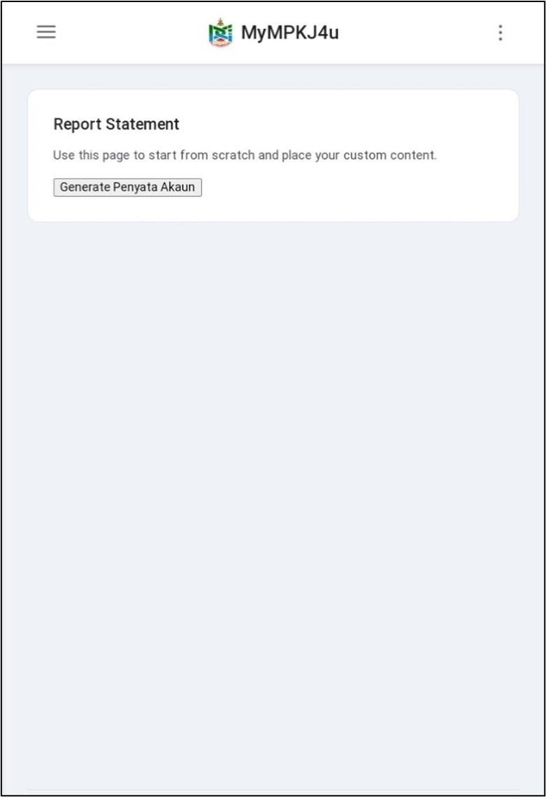
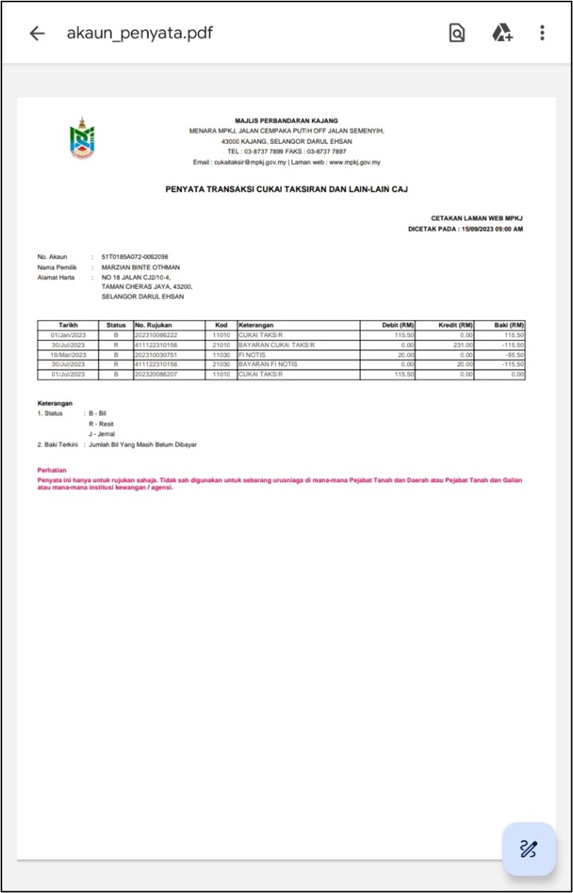

# Panduan Melihat Laporan Penyata Akaun Cukai Taksiran

::: info Tujuan
Membantu pengguna melihat dan memuat turun laporan penyata akaun cukai taksiran dalam sistem MyMPKj4u.
:::

## Langkah-langkah Melihat Laporan Penyata Akaun

### 1. Navigasi ke Menu Penyata Akaun

::: tip Langkah 1
1. Buka pelayar web anda (contohnya Google Chrome)
2. Log masuk ke akaun MyMPKj4u
3. Pada menu utama, klik **Penyata Akaun**
:::

### 2. Jana Penyata Akaun

::: tip Langkah 2
1. Tunggu sehingga halaman **Report Statement** dipaparkan
2. Klik pada butang **Generate Penyata Akaun**
3. Sistem akan menjana laporan penyata akaun cukai taksiran
:::

### 3. Lihat Penyata Akaun

::: tip Langkah 3
Penyata akaun cukai taksiran akan dipaparkan dalam format PDF dengan maklumat berikut:
- Nombor Akaun
- Nama Pemilik
- Alamat
- Tarikh transaksi
- Jenis bil
- Jumlah bayaran
- Status bil
:::

::: warning Peringatan Penting
- Simpan salinan PDF penyata akaun untuk rujukan
- Pastikan semua maklumat yang dipaparkan adalah tepat
- Hubungi pihak MPKJ jika terdapat sebarang percanggahan
:::

::: tip Petua
Anda boleh:
- Muat turun penyata untuk simpanan
- Cetak penyata jika diperlukan
- Gunakan penyata ini untuk urusan rasmi
:::