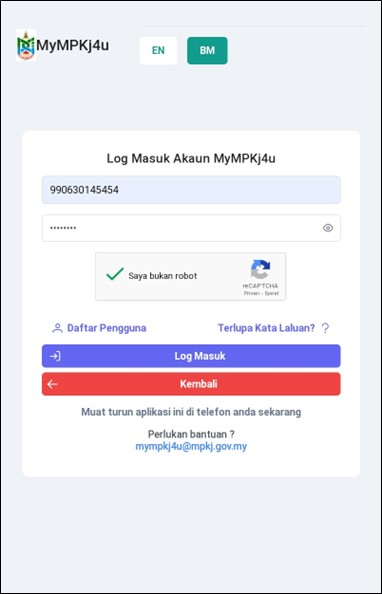
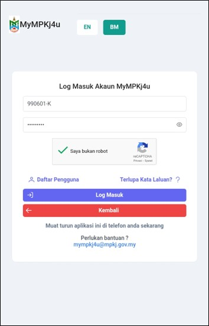

# Panduan Log Masuk Akaun

::: info Tujuan
Membantu pengguna log masuk ke akaun MyMPKj4u sebagai individu atau syarikat.
:::

## Log Masuk Sebagai Pengguna Individu

### 1. Navigasi ke Laman Log Masuk

::: tip Langkah 1
1. Buka pelayar web anda (contohnya Google Chrome)
2. Pergi ke pautan: [https://mympkj4u.mpkj.gov.my/login](https://mympkj4u.mpkj.gov.my/login)
3. Anda akan melihat paparan log masuk seperti di bawah
:::

### 2. Masukkan Maklumat Log Masuk

::: tip Langkah 2
1. Masukkan **No. Kad Pengenalan (NRIC)** anda
2. Masukkan **Kata Laluan** yang telah ditetapkan
3. Tandakan kotak **Saya Bukan Robot** untuk pengesahan
:::

### 3. Log Masuk ke Sistem

::: tip Langkah 3
Klik butang **Log Masuk** untuk mengakses akaun anda
:::

## Log Masuk Sebagai Pengguna Syarikat

### 1. Navigasi ke Laman Log Masuk

::: tip Langkah 1
1. Buka pelayar web anda (contohnya Google Chrome)
2. Pergi ke pautan: [https://mympkj4u.mpkj.gov.my/login](https://mympkj4u.mpkj.gov.my/login)
3. Anda akan melihat paparan log masuk seperti di bawah
:::

### 2. Masukkan Maklumat Log Masuk

::: tip Langkah 2
1. Masukkan **No. SSM Pendaftaran Syarikat (ROB/ROC)**
2. Masukkan **Kata Laluan** yang telah ditetapkan
3. Tandakan kotak **Saya Bukan Robot** untuk pengesahan
:::

### 3. Log Masuk ke Sistem

::: tip Langkah 3
Klik butang **Log Masuk** untuk mengakses akaun anda
:::

::: warning Peringatan Penting
- Pastikan maklumat log masuk yang dimasukkan adalah tepat
- Jangan berkongsi maklumat log masuk dengan orang lain
- Log keluar setelah selesai menggunakan sistem
- Tukar kata laluan secara berkala untuk keselamatan
:::

::: tip Petua
- Simpan nombor NRIC/ROC dan kata laluan di tempat yang selamat
- Gunakan pelayar web yang terkini untuk pengalaman terbaik
- Pastikan sambungan internet anda stabil
:::

::: info Nota
Jika anda menghadapi masalah log masuk:
- Pastikan CAPS LOCK tidak diaktifkan
- Semak ejaan maklumat yang dimasukkan
- Klik **Terlupa Kata Laluan** jika perlu menetapkan semula kata laluan
:::

