# Panduan Pembayaran Bil Cukai Taksiran

- **Tujuan**: Membantu pengguna membuat pembayaran bil cukai taksiran melalui sistem MyMPKj4u dengan kaedah FPX (Online Banking) atau Debit/Kredit Kad.

## Langkah-langkah Membuat Pembayaran Bil Cukai Taksiran

---

### 1. **Navigasi ke Menu Cukai Transaksi**  
   - Buka pelayar web anda (contohnya Google Chrome).  
   - Log masuk ke akaun MyMPKj4u.  
   - Pada halaman utama, klik menu **Cukai Transaksi** seperti dalam gambar di bawah.  

   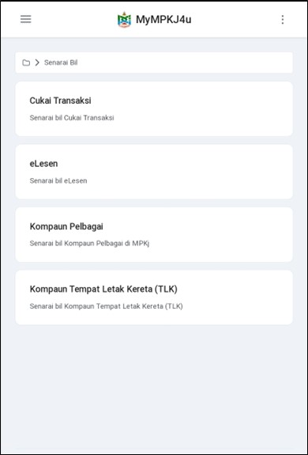

---

### 2. **Klik pada Bil untuk Melihat Maklumat Bil**  
   - Dalam halaman **Senarai Cukai Taksiran**, klik pada bil yang anda ingin bayar untuk melihat maklumat terperinci bil tersebut.  

   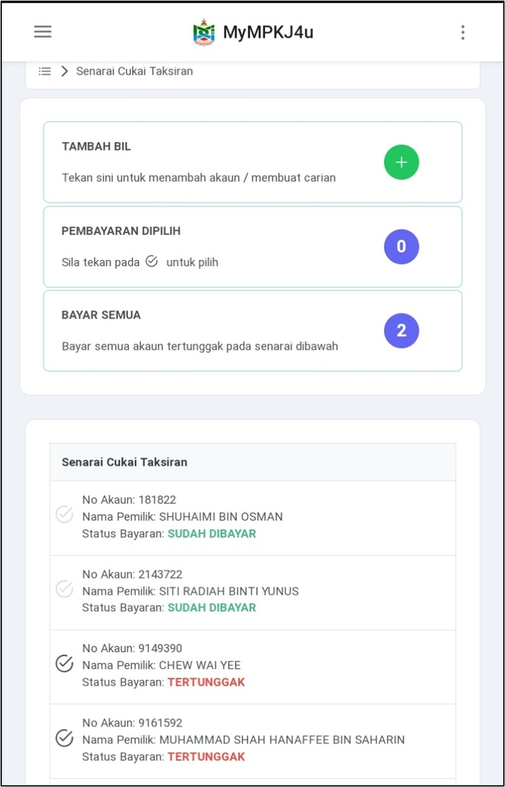

---

### 3. **Maklumat Terperinci Bil**  
   - Maklumat bil akan dipaparkan, termasuk jenis bil, nombor akaun, nama pemilik, alamat, tempoh cukai, dan jumlah bayaran.  
   - Klik pada butang **Bayar** untuk meneruskan pembayaran.  

   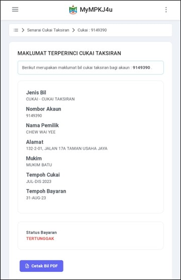  
   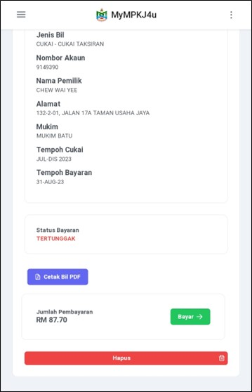

---

### 4. **Maklumat Pembayaran dan Pilih Kaedah Pembayaran**  
   - Maklumat pembayaran seperti nama pembayar, emel pembayar, nombor akaun cukai taksiran, dan jumlah perlu dibayar akan dipaparkan.  
   - Pilih kaedah pembayaran:  
     - **Online Banking (FPX)**  
     - **Kad Kredit / Debit**  

   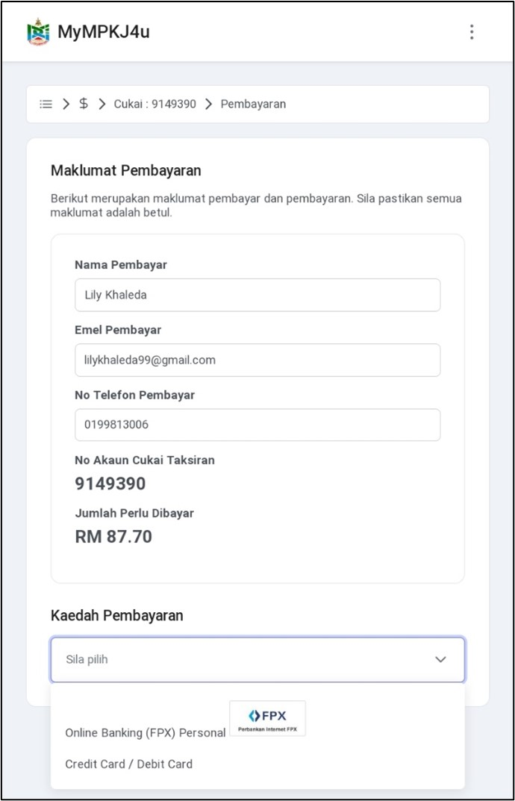  

---

## **Kaedah 1: Pembayaran Melalui FPX (Online Banking)**

---

### 5. **Pilih FPX dan Pilih Bank**  
   - Pilih **FPX** sebagai kaedah pembayaran.  
   - Pilih bank anda (contohnya, **SBI Bank A**) daripada senarai bank yang dipaparkan.  

   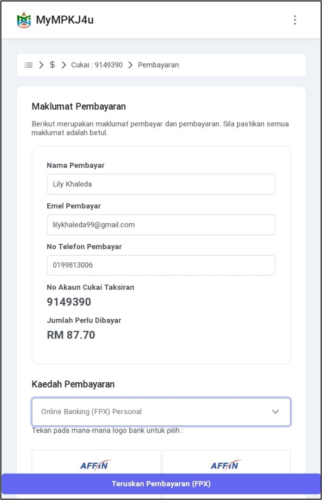  
   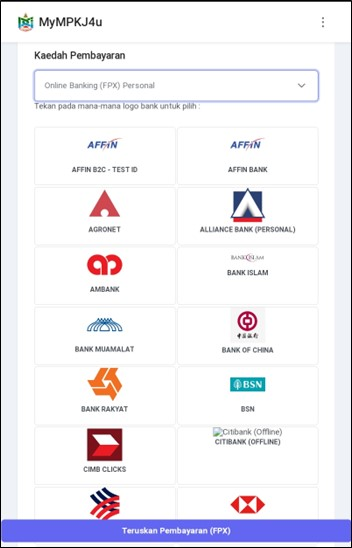

---

### 6. **Pengesahan Bayaran**  
   - Paparan pengesahan pembayaran akan muncul.  
   - Klik pada butang **Teruskan** untuk mengesahkan pembayaran.  

   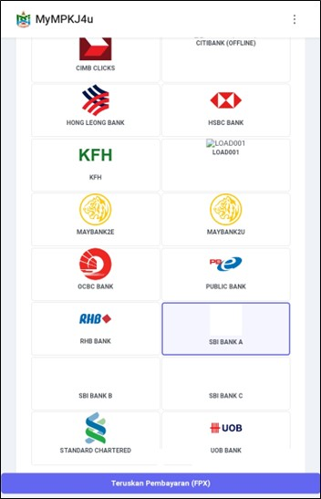

---

### 7. **Log Masuk ke Online Banking**  
   - Anda akan diarahkan ke laman log masuk bank pilihan anda (contohnya, **SBI Bank A**).  
   - Masukkan maklumat berikut:  
     - **User ID**: 1234  
     - **Password**: 1234  
   - Klik butang **Sign In** untuk meneruskan transaksi.  

   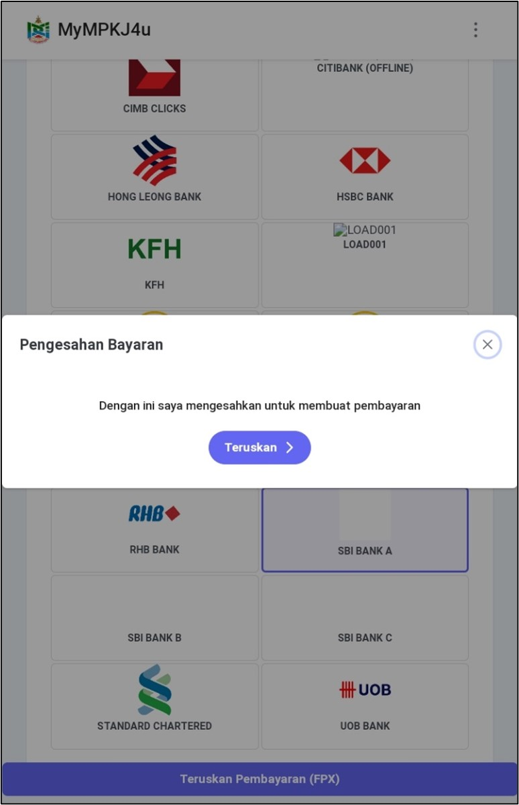  

---

### 8. **Pilih Akaun dan Sahkan Transaksi**  
   - Pilih jenis akaun (contohnya **Savings Account**) dan klik butang **Confirm** untuk mengesahkan pembayaran.  
   - Akaun anda akan didebitkan, dan maklumat transaksi akan dipaparkan.  

   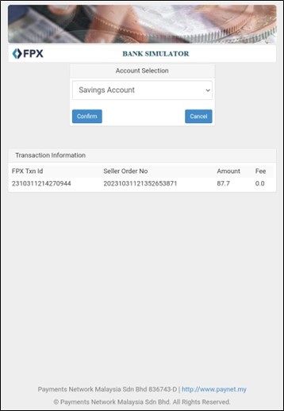  
   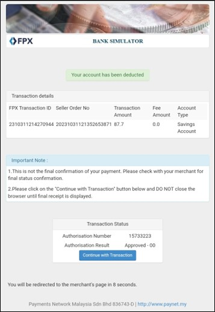  

---

### 9. **Resit Pembayaran**  
   - Selepas pembayaran berjaya, resit automatik akan dijana.  
   - Klik pada butang **Click Here To CLOSE Receipt** untuk menutup resit.  

   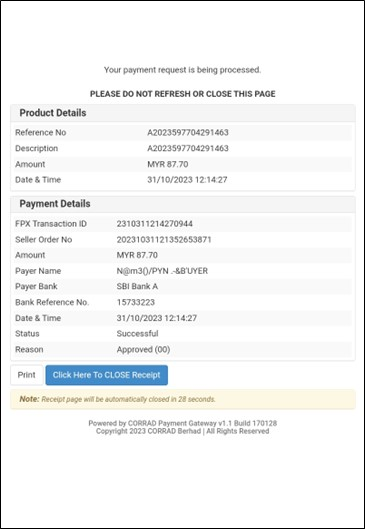  

---

### 10. **Pengesahan Status Pembayaran**  
   - Status bil akan bertukar kepada **Sudah Dibayar**.  
   - Pengguna juga akan menerima emel pengesahan pembayaran berjaya.  

     
   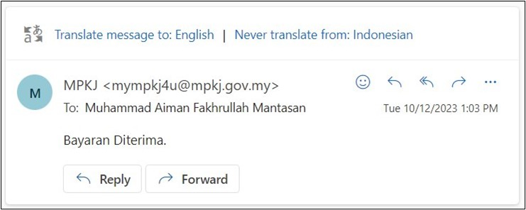  

---

## **Kaedah 2: Pembayaran Melalui Debit/Kredit Kad**

---

### 5. **Pilih Debit/Kredit Kad**  
   - Pilih kaedah pembayaran **Debit/Kredit Kad**.  
   - Klik pada butang **Teruskan Pembayaran (Credit/Debit Card)**.  

   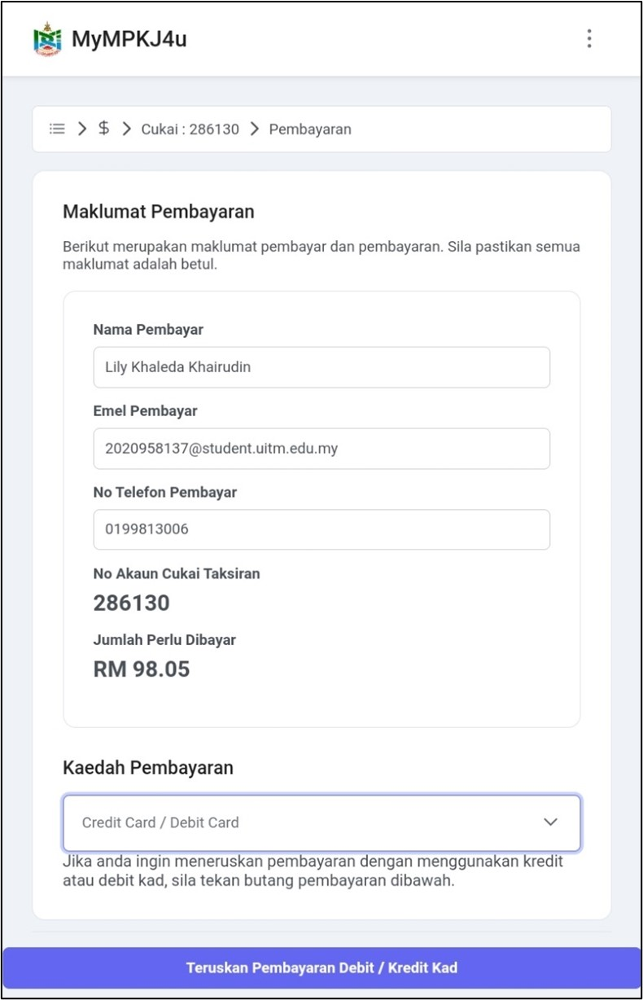  

---

### 6. **Pengesahan Bayaran**  
   - Paparan pengesahan pembayaran akan muncul.  
   - Klik pada butang **Teruskan** untuk mengesahkan pembayaran.  

   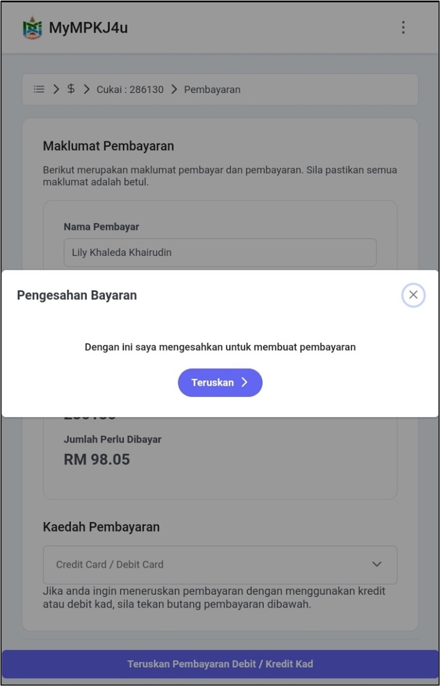  

---

### 7. **Masukkan Maklumat Kad**  
   - Pilih jenis kad yang digunakan, contohnya **MasterCard**.  
   - Masukkan maklumat kad berikut:  
     - **Nombor Kad**: 5123450000000008  
     - **Tarikh Luput**: 01/39  
     - **CVV**: 100  
   - Klik pada butang **Pay** untuk melengkapkan transaksi.  

   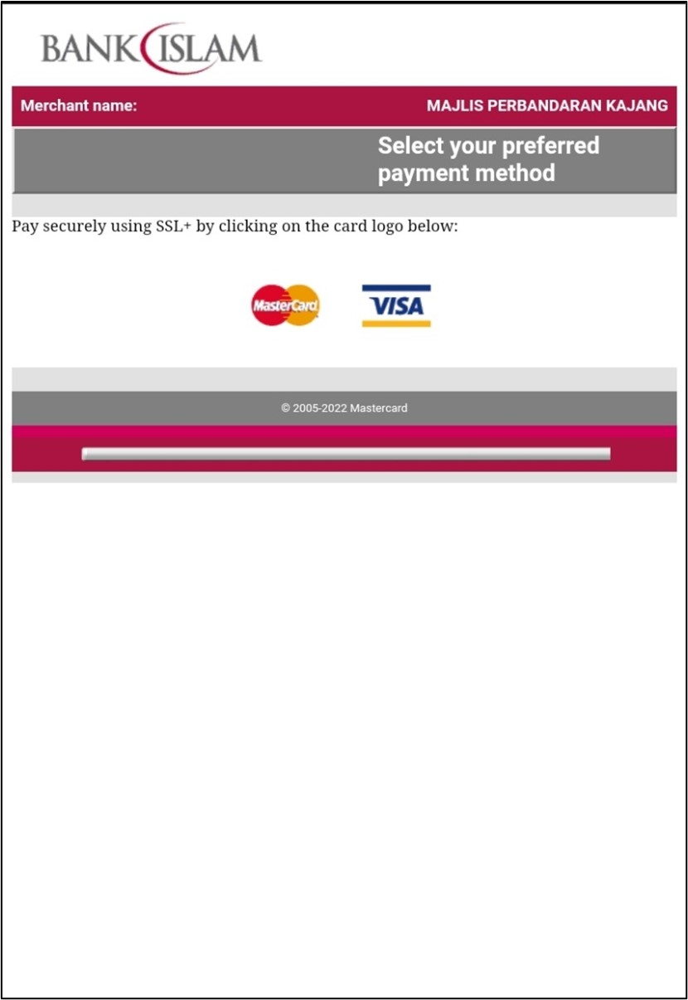  
   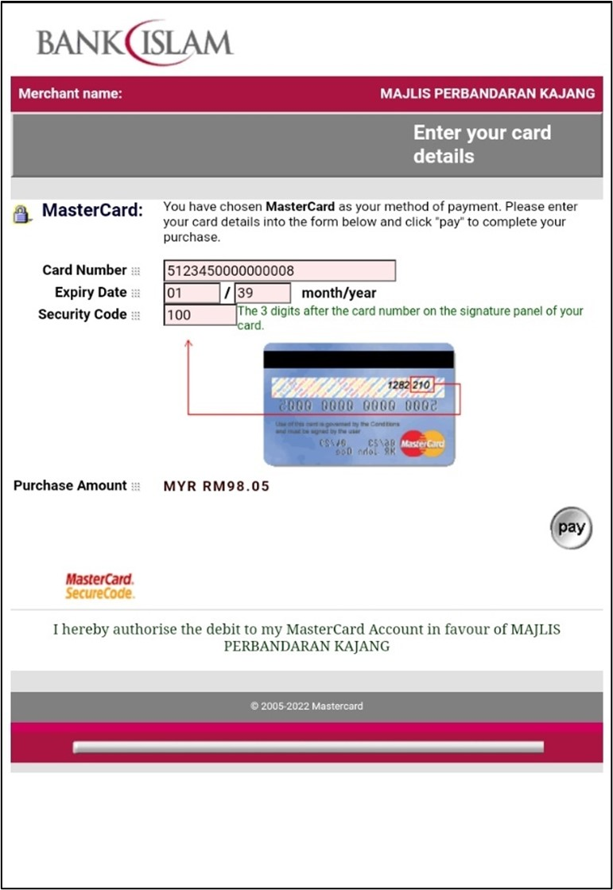  

---

### 8. **Resit Pembayaran dan Pengesahan Status Pembayaran**  
   - Selepas pembayaran berjaya, resit automatik akan dijana.  
   - Status bil akan bertukar kepada **Sudah Dibayar**.  
   - Pengguna juga akan menerima emel pengesahan pembayaran berjaya.  

     
   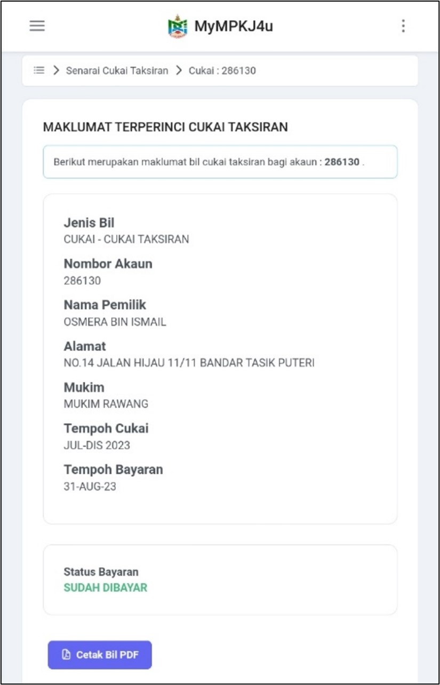
