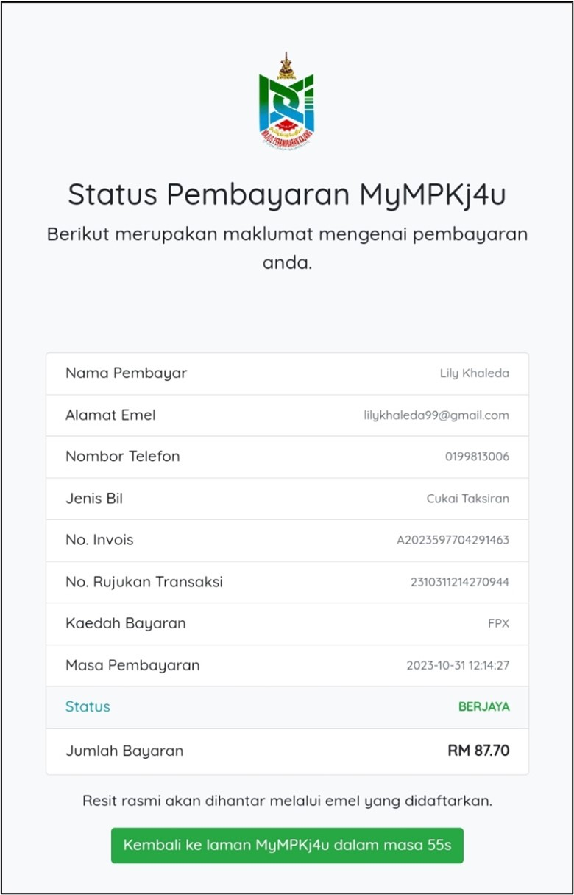

# Panduan Pembayaran Bil Cukai Taksiran

::: info Tujuan
Membantu pengguna membuat pembayaran bil cukai taksiran melalui sistem MyMPKj4u dengan kaedah FPX (Online Banking) atau Debit/Kredit Kad.
:::

## Langkah-langkah Membuat Pembayaran Bil Cukai Taksiran

### 1. Navigasi ke Menu Cukai Transaksi

::: tip Langkah 1
1. Buka pelayar web anda (contohnya Google Chrome)
2. Log masuk ke akaun MyMPKj4u
3. Pada halaman utama, klik menu **Cukai Transaksi** seperti dalam gambar di bawah
:::

### 2. Klik pada Bil untuk Melihat Maklumat Bil

::: tip Langkah 2
Dalam halaman **Senarai Cukai Taksiran**, klik pada bil yang anda ingin bayar untuk melihat maklumat terperinci bil tersebut.
:::

### 3. Maklumat Terperinci Bil

::: tip Langkah 3
1. Maklumat bil akan dipaparkan, termasuk jenis bil, nombor akaun, nama pemilik, alamat, tempoh cukai, dan jumlah bayaran
2. Klik pada butang **Bayar** untuk meneruskan pembayaran
:::

### 4. Maklumat Pembayaran dan Pilih Kaedah Pembayaran

::: tip Langkah 4
1. Maklumat pembayaran seperti nama pembayar, emel pembayar, nombor akaun cukai taksiran, dan jumlah perlu dibayar akan dipaparkan
2. Pilih kaedah pembayaran:
   - **Online Banking (FPX)**
   - **Kad Kredit / Debit**
:::

## Kaedah 1: Pembayaran Melalui FPX (Online Banking)

### 5. Pilih FPX dan Pilih Bank

::: tip Langkah 5
1. Pilih **FPX** sebagai kaedah pembayaran
2. Pilih bank anda (contohnya, **SBI Bank A**) daripada senarai bank yang dipaparkan
:::

### 6. Pengesahan Bayaran

::: tip Langkah 6
1. Paparan pengesahan pembayaran akan muncul
2. Klik pada butang **Teruskan** untuk mengesahkan pembayaran
:::

### 7. Log Masuk ke Online Banking

::: tip Langkah 7
1. Anda akan diarahkan ke laman log masuk bank pilihan anda (contohnya, **SBI Bank A**)
2. Masukkan maklumat berikut:
   - **User ID**: 1234
   - **Password**: 1234
3. Klik butang **Sign In** untuk meneruskan transaksi
:::

### 8. Pilih Akaun dan Sahkan Transaksi

::: tip Langkah 8
1. Pilih jenis akaun (contohnya **Savings Account**) dan klik butang **Confirm** untuk mengesahkan pembayaran
2. Akaun anda akan didebitkan, dan maklumat transaksi akan dipaparkan
:::

### 9. Resit Pembayaran

::: tip Langkah 9
1. Selepas pembayaran berjaya, resit automatik akan dijana
2. Klik pada butang **Click Here To CLOSE Receipt** untuk menutup resit
:::

### 10. Pengesahan Status Pembayaran

::: tip Langkah 10
1. Status bil akan bertukar kepada **Sudah Dibayar**
2. Pengguna juga akan menerima emel pengesahan pembayaran berjaya
:::

## Kaedah 2: Pembayaran Melalui Debit/Kredit Kad

### 5. Pilih Debit/Kredit Kad

::: tip Langkah 5
1. Pilih kaedah pembayaran **Debit/Kredit Kad**
2. Klik pada butang **Teruskan Pembayaran (Credit/Debit Card)**
:::

### 6. Pengesahan Bayaran

::: tip Langkah 6
1. Paparan pengesahan pembayaran akan muncul
2. Klik pada butang **Teruskan** untuk mengesahkan pembayaran
:::

### 7. Masukkan Maklumat Kad

::: tip Langkah 7
1. Pilih jenis kad yang digunakan, contohnya **MasterCard**
2. Masukkan maklumat kad berikut:
   - **Nombor Kad**: 5123450000000008
   - **Tarikh Luput**: 01/39
   - **CVV**: 100
3. Klik pada butang **Pay** untuk melengkapkan transaksi
:::

### 8. Resit Pembayaran dan Pengesahan Status Pembayaran

::: tip Langkah 8
1. Selepas pembayaran berjaya, resit automatik akan dijana
2. Status bil akan bertukar kepada **Sudah Dibayar**
3. Pengguna juga akan menerima emel pengesahan pembayaran berjaya
:::

::: warning Nota Penting
- Pastikan anda mempunyai baki yang mencukupi dalam akaun bank atau kad kredit/debit sebelum membuat pembayaran
- Simpan resit pembayaran untuk rujukan masa hadapan
- Jika menghadapi masalah semasa pembayaran, sila hubungi pihak bank atau MPKJ untuk bantuan
:::
