# Panduan Pembayaran Kompaun Pelbagai

- **Tujuan**: Membantu pengguna membuat pembayaran kompaun pelbagai melalui sistem MyMPKj4u dengan kaedah FPX (Online Banking) atau Debit/Kredit Kad.

## Langkah-langkah Membuat Pembayaran Kompaun Pelbagai

---

### 1. **Navigasi ke Menu Kompaun Pelbagai**
   - Buka pelayar web anda (contohnya Google Chrome).
   - Log masuk ke akaun MyMPKj4u.
   - Pada halaman utama, klik menu **Kompaun Pelbagai**.

   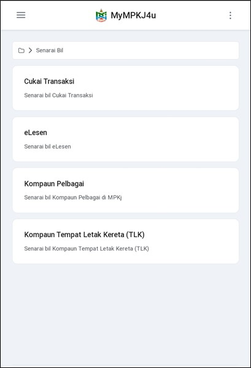

---

### 2. **Pilih Bil untuk Pembayaran**
   - Dalam senarai kompaun, klik pada bil yang ingin dibayar untuk melihat maklumat terperinci.

   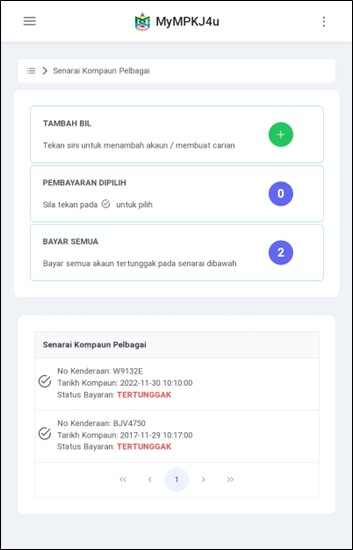

---

### 3. **Maklumat Terperinci Bil**
   - Maklumat terperinci bil akan dipaparkan.
   - Klik butang **Bayar** untuk meneruskan pembayaran.

   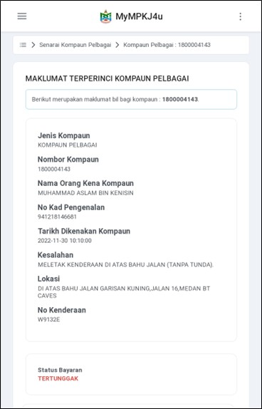
   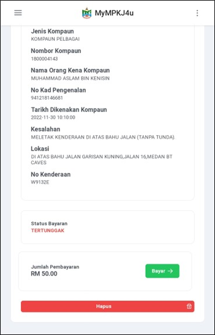

---

## **Kaedah 1: Pembayaran Melalui FPX (Online Banking)**

### 4. **Pilih Kaedah Pembayaran FPX**
   - Pilih kaedah pembayaran **Online Banking (FPX)**.
   - Pilih bank anda (contohnya, **SBI Bank A**).
   - Klik butang **Teruskan Pembayaran (FPX)**.

   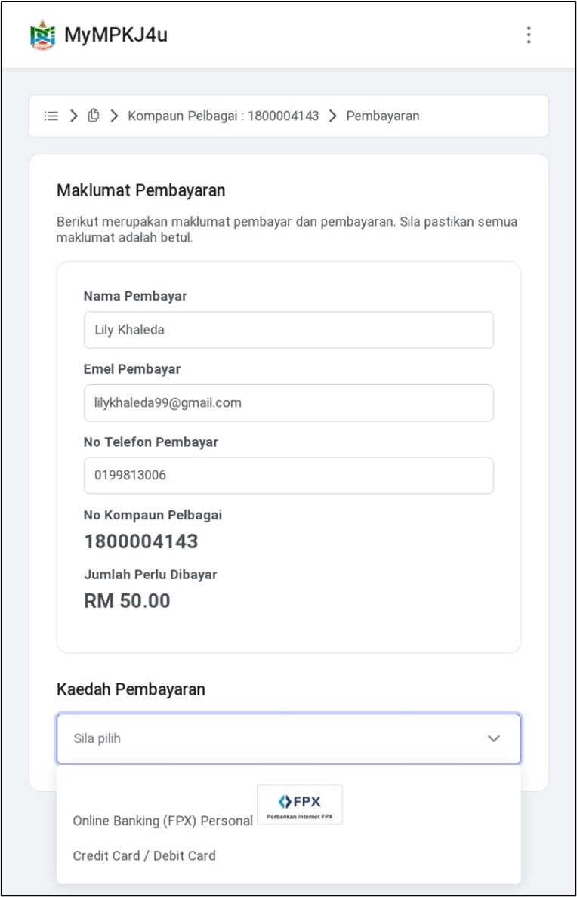
   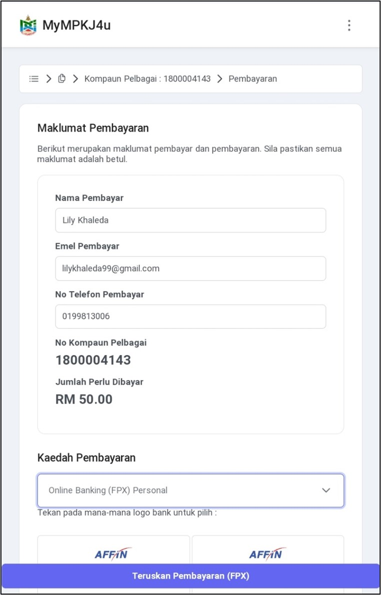
   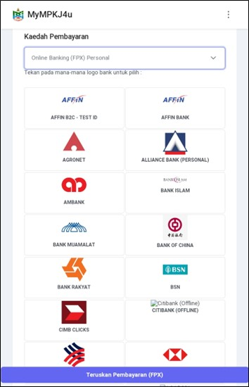
   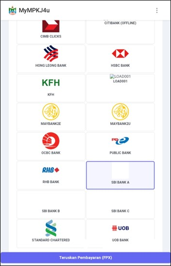

### 5. **Pengesahan Pembayaran**
   - Klik butang **Teruskan** untuk mengesahkan pembayaran.

   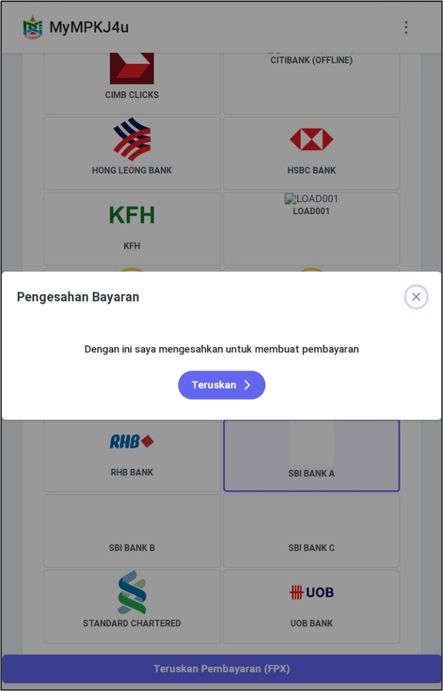

### 6. **Log Masuk ke Online Banking**
   - Masukkan maklumat log masuk:
     - **User ID**: 1234
     - **Password**: 1234

   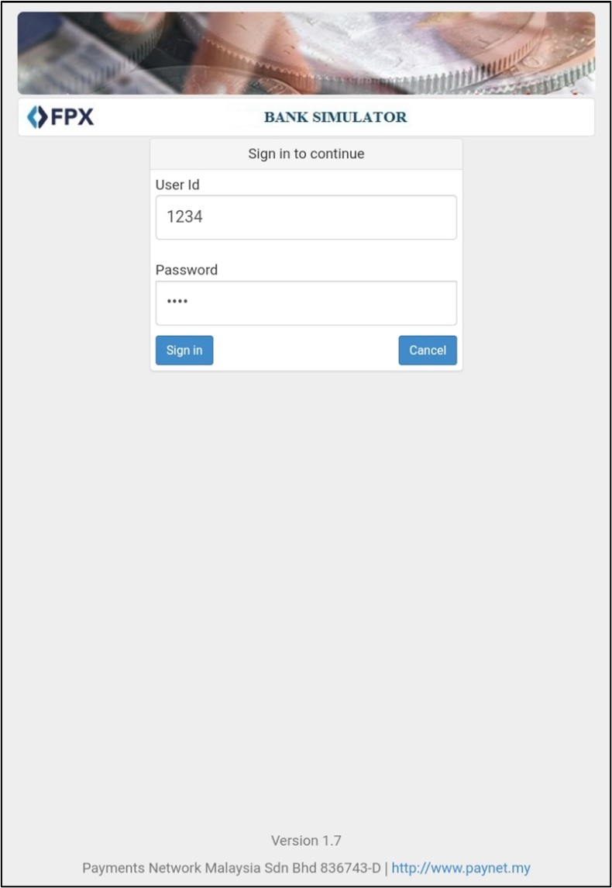

### 7. **Sahkan Transaksi**
   - Pilih jenis akaun (Saving/Current).
   - Klik butang **Confirm** untuk mengesahkan pembayaran.

   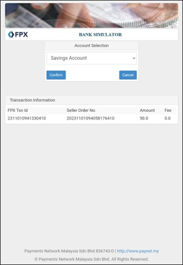
   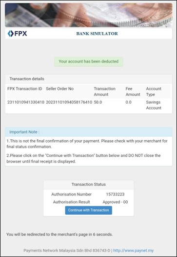

### 8. **Resit dan Pengesahan**
   - Resit pembayaran akan dijana secara automatik.
   - Pengguna akan menerima emel pengesahan pembayaran.
   - Status pembayaran akan bertukar kepada "Sudah Bayar".

   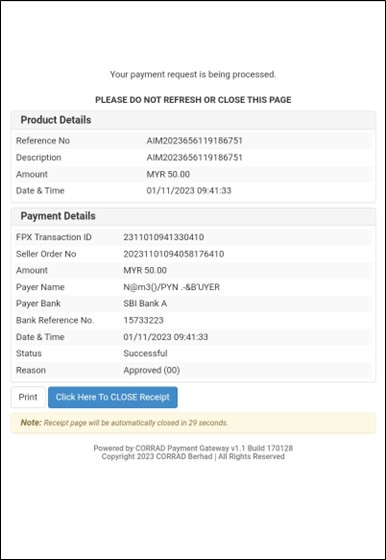
   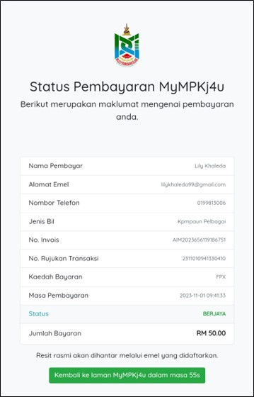
   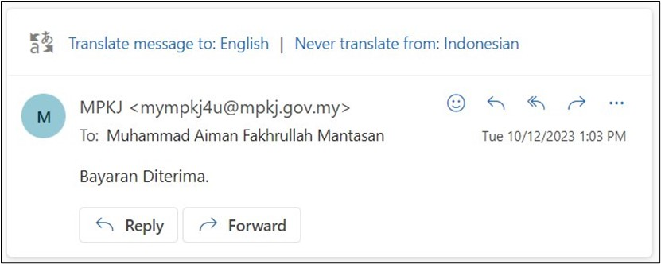
   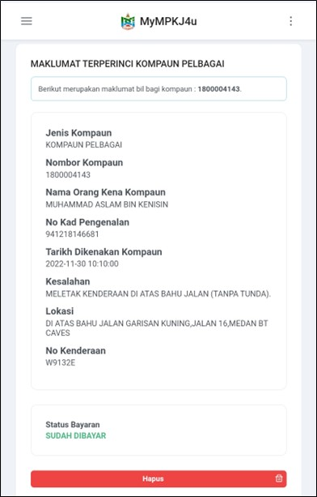

---

## **Kaedah 2: Pembayaran Melalui Kad Debit/Kredit**

### 4. **Pilih Kaedah Pembayaran Kad**
   - Pilih kaedah pembayaran **Debit/Credit Card**.
   - Klik butang **Teruskan Pembayaran (Credit Card)**.

   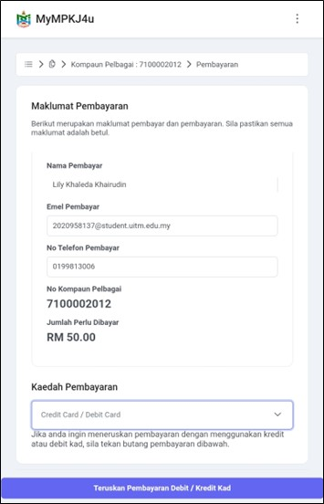

### 5. **Pengesahan Pembayaran**
   - Klik butang **Teruskan** untuk mengesahkan pembayaran.

   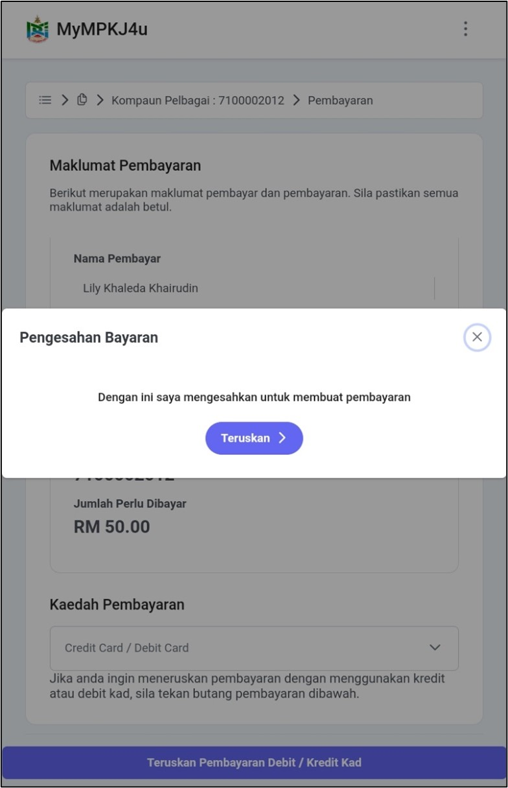

### 6. **Masukkan Maklumat Kad**
   - Pilih jenis kad (MasterCard).
   - Masukkan maklumat kad:
     - **Nombor Kad**: 5123450000000008
     - **Tarikh Luput**: 01/39
     - **CCV**: 100
   - Klik butang **Pay** untuk melengkapkan pembayaran.

   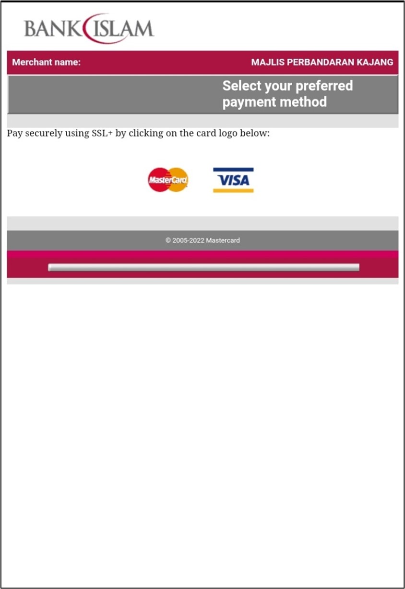
   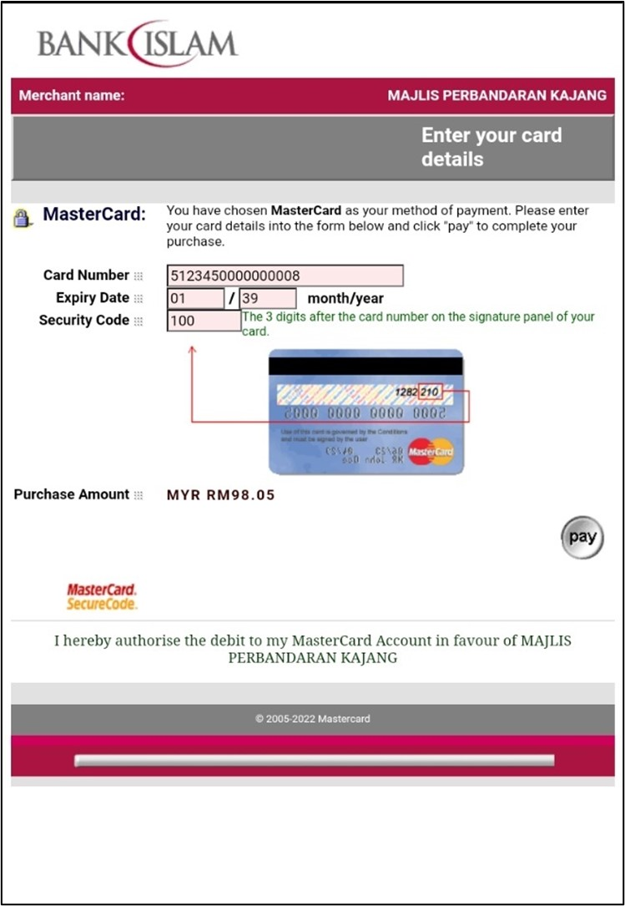

### 7. **Pengesahan dan Status**
   - Pengguna akan menerima emel pengesahan pembayaran.
   - Status pembayaran akan bertukar kepada "Sudah Bayar".

   
   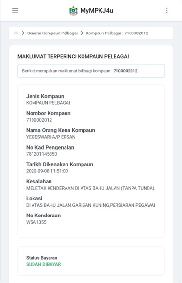

---

::: warning Nota Penting
- Pastikan maklumat pembayaran yang dimasukkan adalah tepat
- Simpan resit pembayaran untuk rujukan
- Status pembayaran akan dikemaskini secara automatik selepas pembayaran berjaya
::: 