# Panduan Pembayaran Kompaun Tempat Letak Kereta (TLK)

- **Tujuan**: Membantu pengguna membuat pembayaran kompaun tempat letak kereta melalui sistem MyMPKj4u dengan kaedah FPX (Online Banking) atau Debit/Kredit Kad.

## Langkah-langkah Membuat Pembayaran Kompaun TLK

---

### 1. **Navigasi ke Menu Kompaun TLK**
   - Buka pelayar web anda (contohnya Google Chrome).
   - Log masuk ke akaun MyMPKj4u.
   - Pada halaman utama, klik menu **Kompaun Tempat Letak Kereta (TLK)** seperti dalam gambar di bawah.

   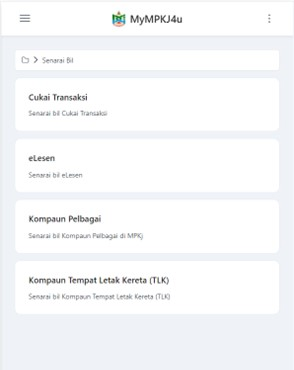

---

### 2. **Klik pada Kompaun untuk Melihat Maklumat**
   - Dalam halaman **Senarai Kompaun TLK**, klik pada kompaun yang anda ingin bayar untuk melihat maklumat terperinci.

   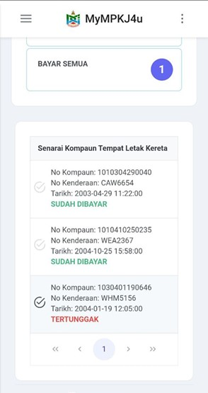

---

### 3. **Maklumat Terperinci Kompaun**
   - Maklumat kompaun akan dipaparkan, termasuk nombor kompaun, nombor kenderaan, dan jumlah bayaran.
   - Klik pada butang **Bayar** untuk meneruskan pembayaran.

   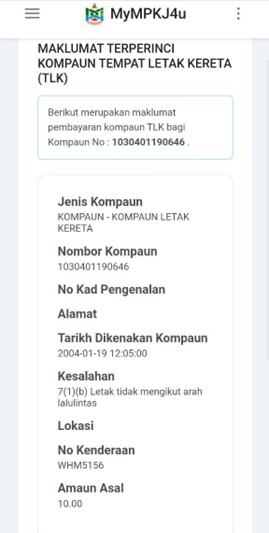
   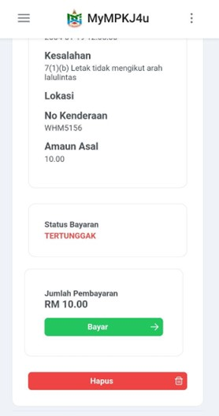

---

### 4. **Maklumat Pembayaran dan Pilih Kaedah Pembayaran**
   - Maklumat pembayaran akan dipaparkan.
   - Pilih kaedah pembayaran:
     - **Online Banking (FPX)**
     - **Kad Kredit / Debit**

   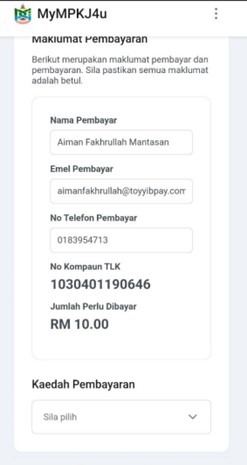

---

## **Kaedah 1: Pembayaran Melalui FPX (Online Banking)**

---

### 5. **Pilih FPX dan Pilih Bank**
   - Pilih **FPX** sebagai kaedah pembayaran.
   - Pilih bank anda (contohnya, **SBI Bank A**) daripada senarai bank yang dipaparkan.
   - Klik butang **Teruskan Pembayaran (FPX)**.

   
   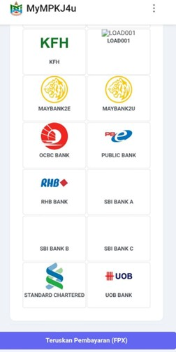

---

### 6. **Pengesahan Bayaran**
   - Paparan pengesahan pembayaran akan muncul.
   - Klik pada butang **Teruskan** untuk mengesahkan pembayaran.

   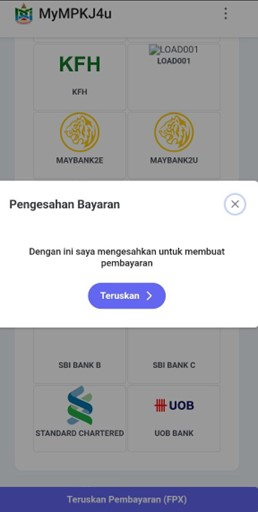

---

### 7. **Log Masuk ke Online Banking**
   - Anda akan diarahkan ke laman log masuk bank pilihan anda.
   - Masukkan maklumat berikut:
     - **User ID**: 1234
     - **Password**: 1234

   

---

### 8. **Pilih Akaun dan Sahkan Transaksi**
   - Pilih jenis akaun (Saving/Current).
   - Klik butang **Confirm** untuk mengesahkan pembayaran.
   - Klik **Continue with Transaction**.

   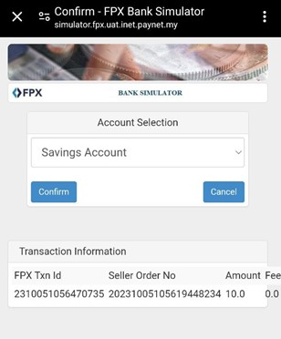
   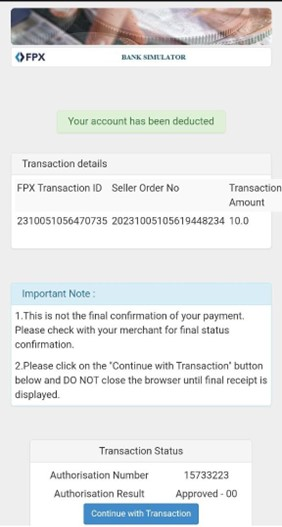

---

### 9. **Resit Pembayaran**
   - Selepas pembayaran berjaya, resit automatik akan dijana.

   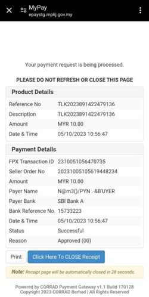
   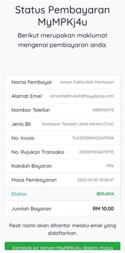

---

### 10. **Pengesahan Status Pembayaran**
   - Status kompaun akan bertukar kepada **Sudah Dibayar**.
   - Pengguna akan menerima emel pengesahan pembayaran berjaya.

   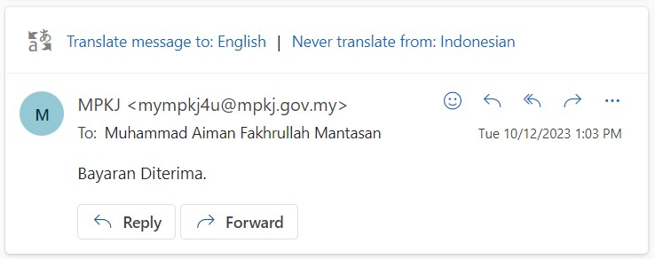
   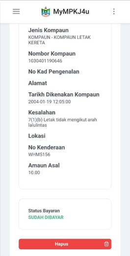

---

## **Kaedah 2: Pembayaran Melalui Debit/Kredit Kad**

---

### 5. **Pilih Debit/Kredit Kad**
   - Pilih kaedah pembayaran **Debit/Kredit Kad**.
   - Klik pada butang **Teruskan Pembayaran Debit / Kredit kad**.

   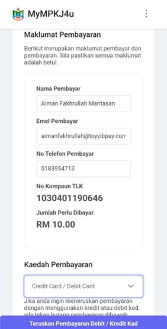

---

### 6. **Pengesahan Bayaran**
   - Paparan pengesahan pembayaran akan muncul.
   - Klik pada butang **Teruskan** untuk mengesahkan pembayaran.

   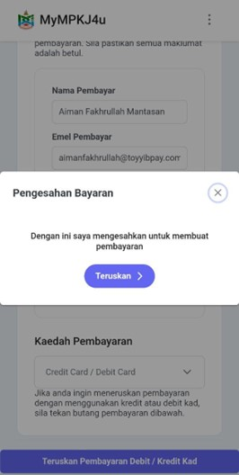

---

### 7. **Masukkan Maklumat Kad**
   - Pilih jenis kad yang digunakan, contohnya **MasterCard**.
   - Masukkan maklumat kad berikut:
     - **Nombor Kad**: 2223000000000007
     - **Tarikh Luput**: 05/21
     - **CVV**: 100
   - Klik pada butang **Pay** untuk melengkapkan transaksi.

   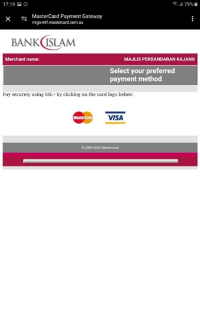
   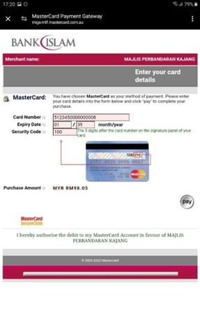

---

### 8. **Pengesahan Status Pembayaran**
   - Selepas pembayaran berjaya:
     - Status kompaun akan bertukar kepada **Sudah Dibayar**
     - Pengguna akan menerima emel pengesahan pembayaran berjaya

   
   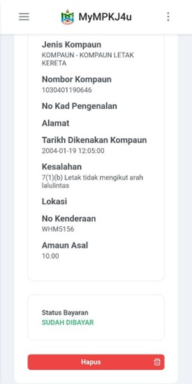

::: warning Nota Penting
- Pastikan maklumat pembayaran yang dimasukkan adalah tepat
- Simpan resit pembayaran untuk rujukan
- Status pembayaran akan dikemaskini secara automatik selepas pembayaran berjaya
::: 