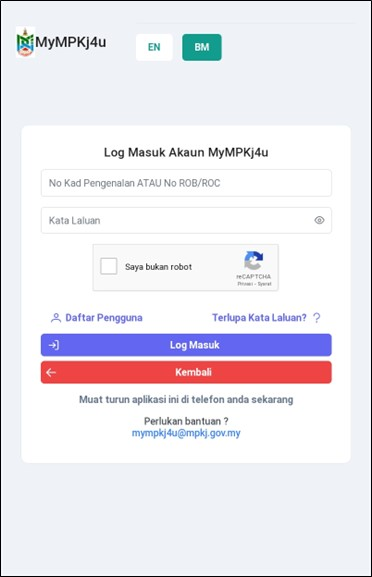
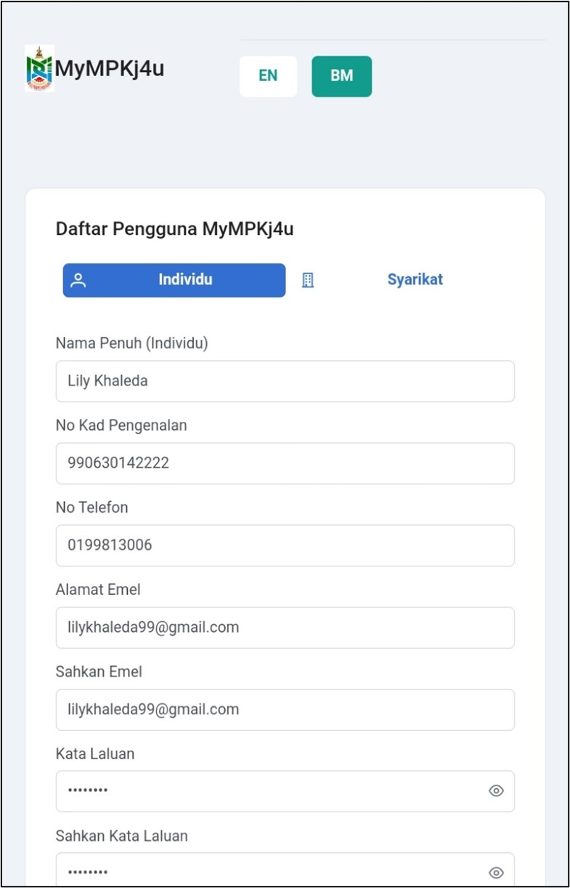
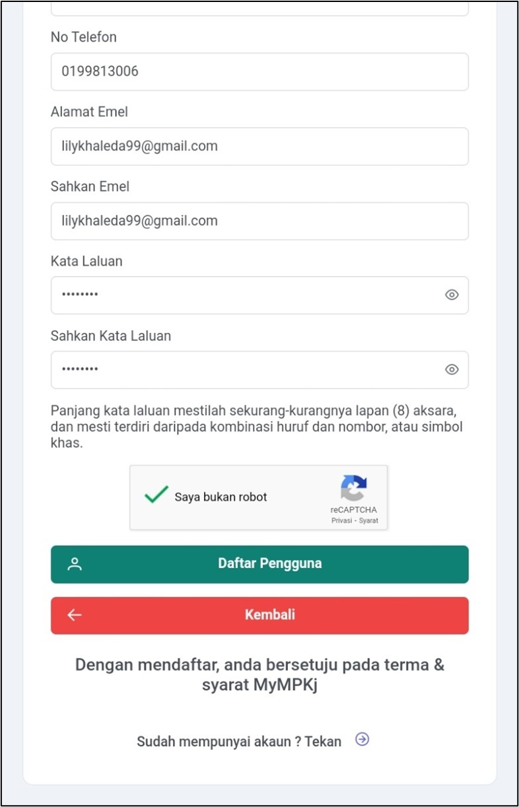
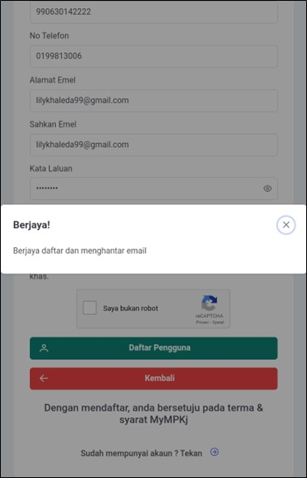
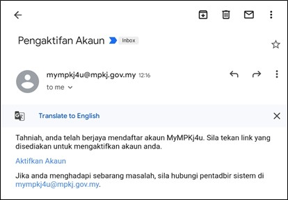
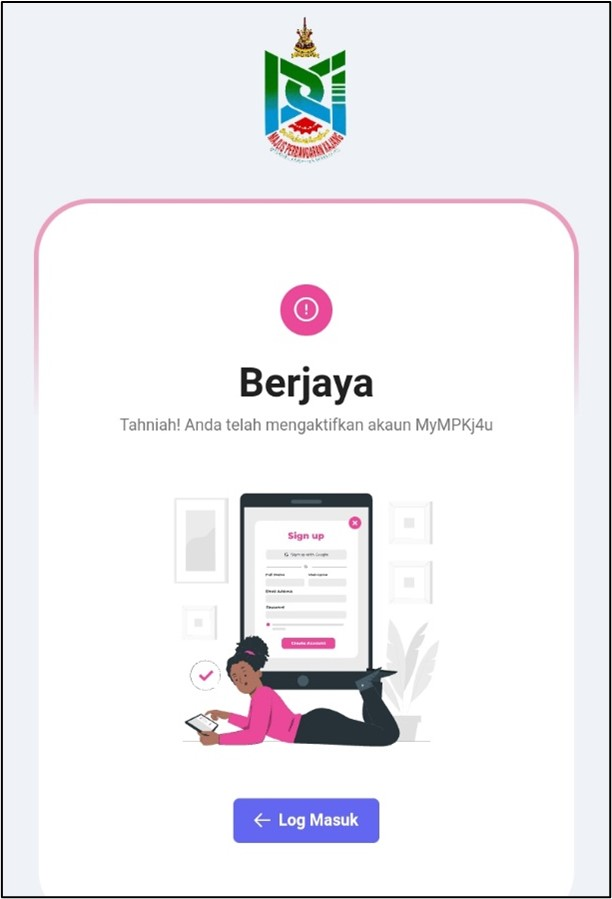

# Panduan Pendaftaran Pengguna

::: info Tujuan
Membantu pengguna mendaftar akaun baru pada platform MyMPKj4u sebagai pengguna individu.
:::

## Langkah-langkah Pendaftaran

### 1. Navigasi ke Laman Pendaftaran

::: tip Langkah 1
1. Buka pelayar web anda (contohnya Google Chrome)
2. Pergi ke pautan: [https://mympkj4u.mpkj.gov.my/register](https://mympkj4u.mpkj.gov.my/register)
3. Anda akan melihat borang pendaftaran seperti di bawah
:::

### 2. Pilih Jenis Pendaftaran

::: tip Langkah 2
1. Pada halaman utama, klik butang **Daftar Pengguna**
2. Pilih tab **Individu** untuk mendaftar sebagai pengguna individu
:::

### 3. Isi Maklumat Peribadi

::: tip Langkah 3
Lengkapkan maklumat berikut di ruangan yang disediakan:
- **Nama Penuh**
- **No Kad Pengenalan (NRIC)**
- **No Telefon**
- **Alamat Emel**
- **Sahkan Emel**
- **Kata Laluan**
- **Sahkan Kata Laluan**
:::

::: warning Keperluan Kata Laluan
Kata laluan mesti:
- Sekurang-kurangnya 8 aksara
- Mengandungi kombinasi huruf, nombor, atau simbol khas
:::

::: info Pengesahan
Tandakan kotak **Saya Bukan Robot** untuk mengesahkan anda bukan bot.
:::

### 4. Hantar Borang Pendaftaran

::: tip Langkah 4
1. Semak semua maklumat yang diisi
2. Klik butang **Daftar Pengguna**
3. Tunggu sehingga mesej **"Berjaya!"** dipaparkan
:::

### 5. Pengesahan Akaun

::: tip Langkah 5
1. Semak emel anda untuk mesej pengesahan dari MyMPKj4u
2. Cari emel dengan tajuk pengesahan akaun
3. Klik pautan **Aktifkan Akaun** dalam emel tersebut
:::

### 6. Log Masuk Sistem

::: tip Langkah 6
1. Tunggu sehingga mesej **"Berjaya!"** dipaparkan
2. Klik butang **Log Masuk** untuk mula menggunakan akaun anda
:::

::: warning Peringatan Penting
- Simpan maklumat log masuk dengan selamat
- Jangan kongsi kata laluan dengan orang lain
- Pastikan emel yang didaftarkan adalah aktif
:::

::: tip Petua
- Gunakan kata laluan yang kukuh dan mudah diingati
- Simpan nombor rujukan pendaftaran (jika ada)
- Aktifkan akaun dengan segera selepas mendaftar
:::