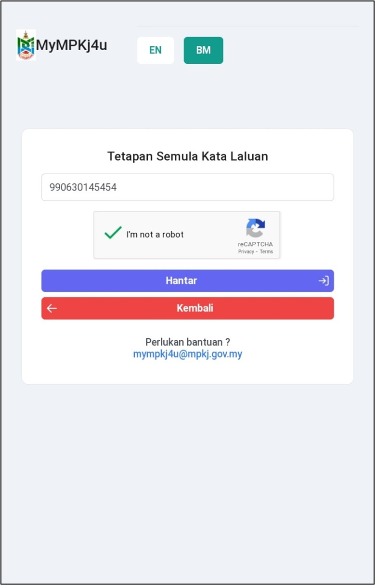
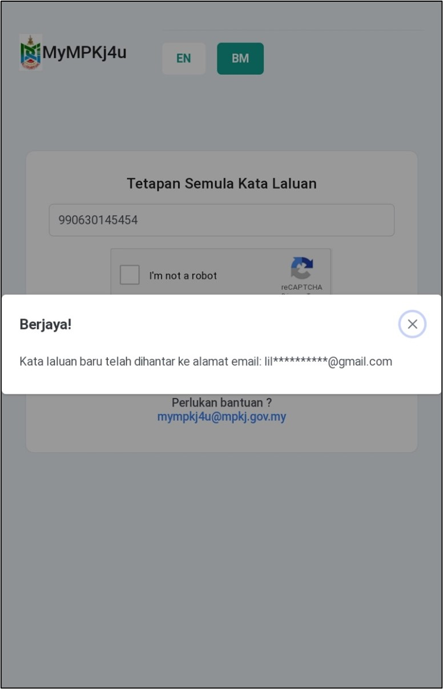
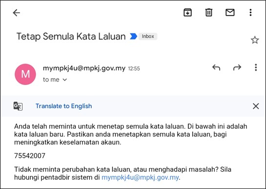

# Panduan Tetapan Semula Kata Laluan

::: info Tujuan
Membantu pengguna menetapkan semula kata laluan MyMPKj4u jika terlupa atau kehilangan akses.
:::

## Langkah-langkah Tetapan Semula Kata Laluan

### 1. Navigasi ke Laman Tetapan Semula

::: tip Langkah 1
1. Buka pelayar web anda (contohnya Google Chrome)
2. Pergi ke pautan: [https://mympkj4u.mpkj.gov.my/forgotpassword](https://mympkj4u.mpkj.gov.my/forgotpassword)
3. Atau klik pautan **Terlupa Kata Laluan?** di halaman log masuk
:::

### 2. Masukkan Maklumat Pengesahan

::: tip Langkah 2
1. Masukkan salah satu maklumat berikut:
   - **No. Kad Pengenalan (NRIC)** untuk akaun individu
   - **No. SSM Pendaftaran Syarikat (ROB/ROC)** untuk akaun syarikat
2. Tandakan kotak **I'm Not a Robot** untuk pengesahan
:::

### 3. Hantar Permohonan

::: tip Langkah 3
1. Klik butang **Hantar** untuk memproses permohonan
2. Tunggu sehingga mesej **"Berjaya!"** dipaparkan
:::

### 4. Semak E-mel

::: tip Langkah 4
1. Buka akaun e-mel yang didaftarkan
2. Cari e-mel dari sistem MyMPKj4u
3. E-mel akan mengandungi kata laluan baharu anda
:::

::: warning Peringatan Penting
- Pastikan anda mempunyai akses ke e-mel yang didaftarkan
- Tukar kata laluan baharu selepas berjaya log masuk
- Jangan kongsi kata laluan dengan orang lain
:::

::: tip Petua Keselamatan
- Gunakan kata laluan yang kukuh dan unik
- Elakkan menggunakan maklumat peribadi dalam kata laluan
- Simpan kata laluan di tempat yang selamat
- Tukar kata laluan secara berkala untuk keselamatan tambahan
:::

::: info Nota
Jika anda tidak menerima e-mel dalam masa 15 minit:
- Semak folder SPAM/JUNK
- Pastikan alamat e-mel yang didaftarkan adalah betul
- Cuba proses tetapan semula sekali lagi
:::